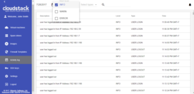

# Cloudstack UI
Cloudstack UI is a project which purpose is to develop easy to use, light and user friendly frontend interface for Apache Cloudstack virtualization management system. Cloudstack itself is great product which is used widely but it's frontend is developed for administrators, not for end users. Some of behaviours are not transparent and not natural to average user and require quite long adaptation. Another reasons to develop are connected with lack of functions like virtual machine statistics & charting, sophisticated resource accounting and application management. This are in our long-term TODO list.

## Project Story

We at Bitworks run an ACS public cloud for 3 years (actually we still run CS 4.3 cloud in production) and we found that average users which are familiar to Digital Ocean, Amazon AWS and other VPS management systems feel uncomfortable with Cloudstack UI and make a lot of operational mistakes. That's why we decided to implement convinient and neat end-user facing UI covering regular activities which are important for day to day VM management.

The project is developed by Bitworks Software Frontend Division during educational marathon which purpose was to incorporate new team members and show them our standard development instruments for frontend development.

## Implementation Details

* Designed compatible with Apache Cloudstack 4.9 and wasn't tested with previous versions of CS
* Powered by Angular 2 and Google Material Design

## Features Supported

Since we designed the product from the perspective of well-known use cases which are common to our public cloud deployment we implemented only ones which are 100% required and covers most of use cases. May be in another deployment there are other requirements, but it's open source product indeed. 

So, what is supported:

* Basic Cloudstack zones with virtual router
* Security groups
* KVM Hypervisor
* Security group templates
* Multiple zones
* Virtual machine standard operations supported by Apache Cloudstack
* Root and Data disks management
* Ad-hoc and periodical snapshots for disks
* Affinity groups management
* VM groups
* Localization support
* Frontend Themes, Custom VM colors
* Custom and Fixed service and disk offerings

## Features Yet Unsupported

We intensively use features like projects in our own Cloudstack cloud to manage resources dedicated to project groups, etc. but generic users don't need them, so we don't support next features yet:

* Advanced Zones
* Other hypervisors than KVM are not tested
* Domains

## Current To Do's

* Projects
* Responsive interface for smart devices
* SSH keys management
* API keys management
* Password management

## Long Term To Do's

* VM metrics a.k.a. Pulse Plugin
* VM expenses like resource utilization stats, traffic, IO stats a.k.a. Accounting Plugin
* Applications a.k.a. Roller Plugin

## Screenshots & Feature description

#### Login view

Just simple login screen. Nothing specially new. But it has nice preloader which can be used to brand it for specific company. By default it shows Apache Cloudstack banner.

#### Virtual machines view

This screen was rethinked very greatly. First of all, we implemented "one step" approach everywhere and also we did it work without moving from view to view like ACS native interface works. Thus, all actions on VM instances are managed from the same screen. Also, the interface allows to view several zones immediately, group virtual machines by zones, by logical groups (e.g. Databases, WWW) and by colors. We added an facility to brush virtual machine with specific color to make it look unique and meaingful to user from a certain perspective. Also we moved most of VM information to the sidebar which now has two tabs - the firtst one is for general view and virtual-machine related activities (like security groups, additional ips) and the second one is for virtual machine storage management (disks, snapshots and ISO).

#### Activity log view

It's simplified view for account activities. It allows choosing the date and levels and see all of them. It's close to the same screen in ACS native UI but we believe that an user is interested in events of specific date and scrolling huge event log back to find something is not productive. Sometimes HelpDesk service just wants to show user that something had happened at specific date and thus the interface allows finding information easier.  

## Project Sponsors

Currently project is supported by [Bitworks Software](https://bitworks.software/).

## How to Contribute

You can contribute to development of the project in various ways:

1. Share the information about the project with other people, try to install the UI and share your opinion with us and your fellows.
2. Propose useful feature. Ideas are always welcome. 
3. Deploy it somewhere and inform us about success story and we will share it in adopters section.
4. Fix bugs and send us PR.
5. Implement a feature from Roadmap or just do something which is new.
6. Support and promote the development of specific functions which are important to you and may be shared.
7. Hire us for frontend or backend development of custom software development projects. Take a look at our [website](https://bitworks.software/) to know where we can be useful. Take a look at our presentation to know more about us.

To do a contribution, just contact us with next e-mail: info@bw-sw.com

## License

It's released under Apache 2.0 license.

# Documentation

## Deployment

## Configuration Options

